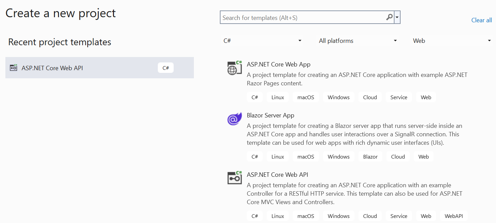
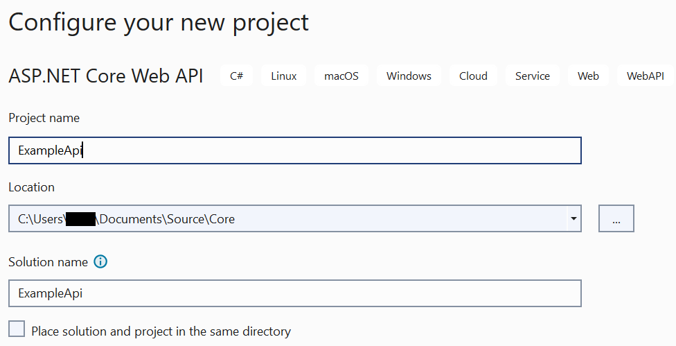
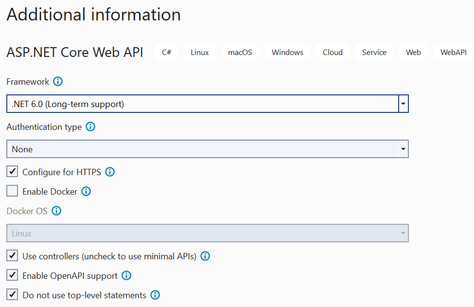
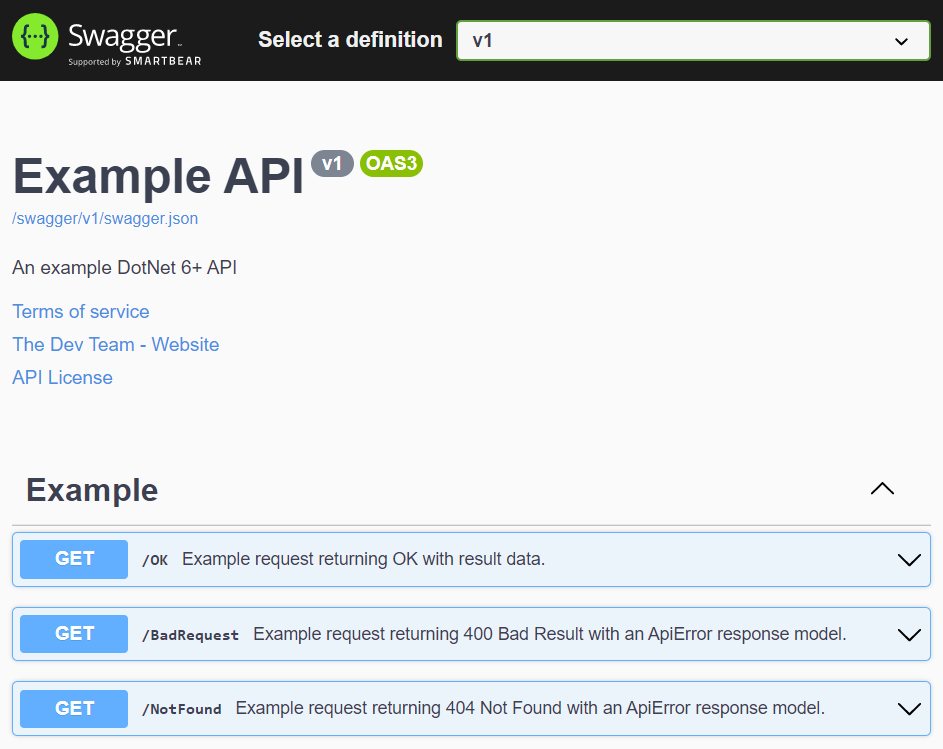

# EXAMPLE API

An example API in C#/DotNet 6 (Core) with sequential commits to show reference code and functionality being added.

- [LICENSE.txt](./LICENSE.txt) (AGPL)
- [CHANGELOG.md](./CHANGELOG.md)

## Contents

- [Running the API](#running-the-api)
- [Creating the API](#creating-the-api)
- [Sample Swagger page](#sample-swagger-page)

## Running the API

- You'll need the SDK for [DotNet 6](https://dotnet.microsoft.com/en-us/) or later
- Clone (or download) this repo
- Run the API
  - Either navigate in a command prompt/terminal and run `dotnet run --project ExampleApi`
  - Or open in [Visual Studio](https://visualstudio.microsoft.com/vs/) or [Rider](https://www.jetbrains.com/rider/) and run the *ExampleApi* project from there
- [When run the API will be available here](https://localhost:5001/docs)

## Creating the API

This is a standard out of the box API which is then iterated over with further commits. [You can view those commits here](https://github.com/kcartlidge/ExampleApi/commits/main). To get to the initial starting point yourself in a new API, these are the choices I made:

Choosing a project type:

Configuring the project:

Additional information:

---

Please note that this repo includes a `.editorconfig` file. Visual Studio will happily use it, but you should *not* edit it with its GUI editor. Doing so will likely add a large number of Microsoft-specific extra settings.

## Sample Swagger page

This is from when the XML summary comments have just been included and metadata added to the SwaggerDoc details in `Program.cs`.

